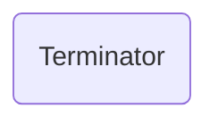
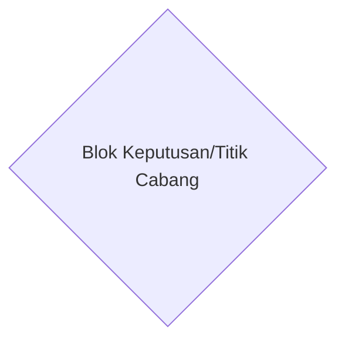

# Makna setiap objek Diagram alir

## Garis Alir

Anak panah arah yang menunjukan aliran program dair awal hingga akhir.
## Terminator

Digunakan untuk menunjukan titik awal dan akhir sebuah program/algoritma.
## Blok Proses

## Blok Keputusan/Control Flow

Melambangkan titik dimana program bercabang.

# Contoh contoh Diagram
## Menghitung Luas Permukaan Kubus
