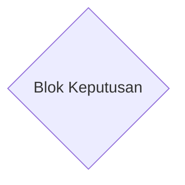
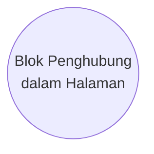
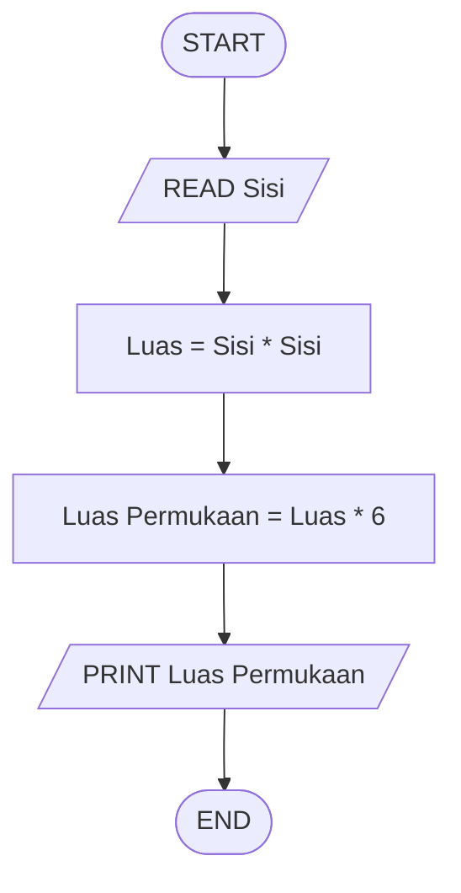

---
tags:
  - Catatan
---
# Makna setiap objek dalam Diagram alir
> [!info]
> Notasi dan Simbol Diagram alir pertama dibuat oleh ASME ([American Society of Mechanical Engineers (ASME)](https://en.wikipedia.org/wiki/American_Society_of_Mechanical_Engineers "American Society of Mechanical Engineers")) pada 1921 yang lalu distandarisasi oleh ANSI ([American National Standards Institute](https://en.wikipedia.org/wiki/American_National_Standards_Institute "American National Standards Institute")) pada 1960an. Standar internasional dibuat oleh ISO ([International Organization for Standardization](https://en.wikipedia.org/wiki/International_Organization_for_Standardization "International Organization for Standardization")) yang mengadopsi diagram alir ANSI pada 1970an. Standar diagram alir secara internasional dikenal sebagai ISO 5807 yang dipublikasi pada 1985 dan terakhir direview di 2019. 

## Garis Alir

Anak panah arah yang menunjukan aliran program dair awal hingga akhir.
## Terminator

Digunakan untuk menunjukan titik awal dan akhir sebuah program/algoritma.
## Blok Proses

Suatu kegiatan komputasi yang dilakukan oleh program: misalnya operasi aritmatika.
## Blok Keputusan/Control Flow

Melambangkan titik dimana program bercabang.
## Blok Masukan

Melambangkan titik saat program akan menerima suatu data atau menghasilkan suatu informasi.
## Blok Subprogram

Melambangkan suatu kegiatan atau proses lain yang telah didefinisikan sebelumnya.
## Blok Penghubung dalam Halaman

Digunakan untuk menghubungkan suatu titik pada diagram alir ke titik lain pada halaman yang sama.
## Blok Penghubung Antarhalaman
![[../Media/Blok Penghubung Antarhalaman.png|100x80]]

Digunakan untuk menghubungkan suatu titik pada diagram alir ke titik lain pada halaman yang berbeda. Digunakan apabila diagram lain cukup kompleks sehingga tidak dapat digambar dalam satu halaman.
# Contoh Diagram Alir
## Menghitung Luas Permukaan Kubus
