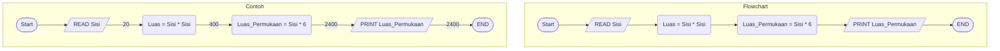
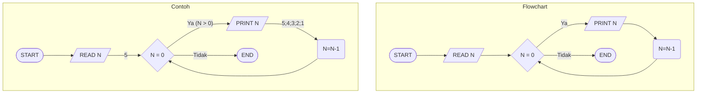
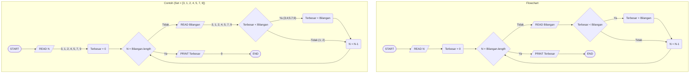

# Menghitung Luas Permukaan Kubus

# Membagi Bilangan

```mermaid
flowchart TD
	subgraph Flowchart
	start([START]) --> read[/READ Pembilang Penyebut/]
	read --> des{Penyebut = 0?}
	des -- Tidak --> calc(Hasil = Pembilang ÷ Penyebut)
	des -- Ya --> disallow[/PRINT Penyebut tidak boleh Nol/]
	calc --> result[/PRINT Hasil/]
	result --> enD([END])
	disallow --> enD
	end
	subgraph Kasus A
	startA([START]) --> readA[/READ Pembilang Penyebut/]
	readA -- 10, 2--> desA{Penyebut = 0?}
	desA -- Tidak (2 > 0) --> calcA(Hasil = Pembilang ÷ Penyebut)
	calcA -- 5 --> resultA[/PRINT Hasil/]
	desA --x disallowA[/PRINT Penyebut tidak boleh Nol/]
	resultA -- 5 --> enDA([END])
	disallowA --> enDA
	end
	subgraph Kasus B
	startB([START]) --> readB[/READ Pembilang Penyebut/]
	readB -- 8, 0--> desB{Penyebut = 0?}
	desB -- Tidak --> calcB(Hasil = Pembilang ÷ Penyebut)
	desB -- Ya (0 = 0)--> disallowB[/PRINT Penyebut tidak boleh Nol/]
	calcB --> resultB[/PRINT Hasil/]
	resultB --> enDB([END])
	disallowB -- Penyebut tidak boleh Nol --> enDB
	end
```

# Menghitung Mundur dari N hingga 1

# Mencari Bilangan Terbesar dari Suatu Himpunan Bilangan

> [!tip]
> *Semicolon (;) berarti akhir baris atau Iterasi.*

> Diatas menggunakan `Bilangan.length` karena menggunakan `N = 0` menghasilkan logika yang salah.