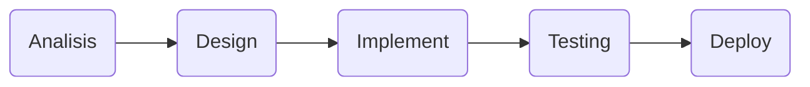

Tahap pertama untuk membuat sebuah program terlihat dalam diagram dibawah:

1. Dalam tahap `Analisis`, `System Analyst` mencari `Requirements` (kebutuhan) untuk program tersebut yang terdiri dari `User Requirements`, `System/Hardware Requirements`, dan `Software Requirements`. Ada juga pembuatan visualisasi algoritma yang membuat `pseudocode`,`flowchart` dan `ERD (Entity Relationship Diagram)`.
2. Setelah selesai `Analisis`, Tahap selanjutnya adalah `Design` yang dilakukan `System Designer`. `System Designer` adalah membuat bagian `UI` dan `UX` sebuah program.
3. Pada tahap `Implement`, `Programmer` akan melakukan `coding` untuk membuat program tersebut.
4. Pada tahap `Testing`, Program akan di tes dengan berbagai cara dengan lingkungan yang berbeda `(Internal Testing, Closed/Open Beta)`. Jika ditemukan `bug` akan kembali ke tahap `Implement` untuk `debugging`.
5. Pada tahap terakhir yaitu `Deploy` program akan dirilis ke pengguna.
