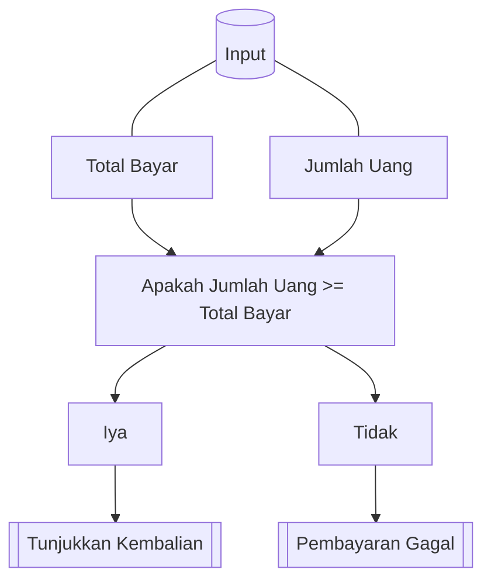

---
tags:
  - Catatan
share: "true"
---
Psudocode *(kode semu)* adalah suatu bahasa buatan manusia yang sifatnya informal sebagai representasi algoritma. *Psudocode* dibuat untuk menutupi kekurangan diagram alir dalam merepresentasikan konsep konsep pemrograman ter-struktur. *Psudocode* memungkinkan representasi langkah langkah yang lebih detail dan dekat bahasa pemrograman. *Psudocode* menggunakan sistem pernyataan per baris dan indentasi untuk menunjukan struktur.

## Kasus Penggunaan:
	Mesin Pembayaran Bakso
`Diagram Alir`


`Kode Python`
```python
total_bayar = 150
print("Total pembayaran adalah", total_bayar)
jumlah_uang = 100

if total_bayar == jumlah_uang:
	print("Pembayaran berhasil!")
elif jumlah_uang <= total_bayar:
	print("Uang anda tidak cukup!")
else:
	print("Pembayaran berhasil! Kembalian:", jumlah_uang-total_bayar)
```