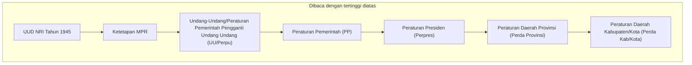

```mermaid
flowchart TD
	subgraph "Dibaca dengan tertinggi diatas"
	1[UUD NRI Tahun 1945] --> 2[Ketetapan MPR]
	2 --> 3["Undang-Undang/Peraturan Pemerintah Pengganti Undang Undang (UU/Perpu)"]
	3 --> 4["Peraturan Pemerintah (PP)"]
	4 --> 5["Peraturan Presiden (Perpres)"]
	5 --> 6["Peraturan Daerah Provinsi (Perda Provinsi)"]
	6 --> 7["Peraturan Daerah Kabupaten/Kota (Perda Kab/Kota)"]
	end
```